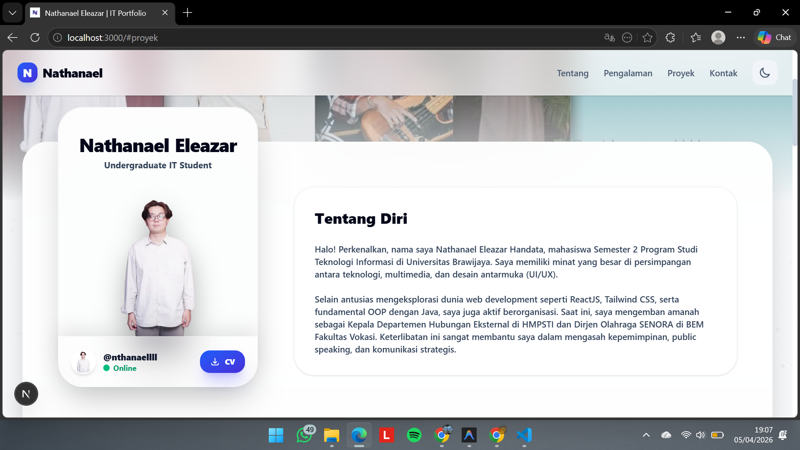

# 🚀 Nathanael's Personal IT Portfolio

A modern, highly interactive personal portfolio website built to showcase my journey as an Information Technology student, web developer, and creative designer. 

## ✨ Key Features
* **Smart Splash Screen:** A seamless, state-preserved initial loading animation that doesn't annoy users during page navigation.
* **Dynamic Case Studies:** Built with Next.js App Router ([slug]), allowing easy addition of new projects with deep-dive technical explanations, problem-solving stories, and live demo links.
* **Interactive UI/UX:** Features a 3D holographic profile card, smooth page transitions, and hover effects powered by Framer Motion.
* **Project Documentation Gallery:** A masonry-style photo gallery with a built-in lightbox modal to showcase UI/UX designs and event documentations.
* **Tech Stack Showcase:** A smooth, manually scrollable marquee to display programming languages and tools.
* **Dark/Light Mode Ready:** Fully styled with Tailwind's dark mode utilities for comfortable viewing in any environment.

## 🛠️ Tech Stack
* **Framework:** Next.js (App Router)
* **Library:** React.js
* **Language:** TypeScript
* **Styling:** Tailwind CSS
* **Animation:** Framer Motion
* **Deployment:** Vercel

## 📂 Project Structure
- `/app` - Next.js App Router layout, pages, and global styles.
  - `/components` - Reusable UI components (Navbar, Cards, Splash Screen, Sections).
  - `/data` - Centralized data configuration (portfolio.ts) for projects, skills, and gallery items.
  - `/projects/[slug]` - Dynamic route for generating individual Case Study pages.
- `/public` - Static assets, images, SVG icons, and gallery documentations.
- `/types` - TypeScript interfaces for strong typing across the application.

## ⚙️ Local Installation & Setup

1. Clone the repository:
   `git clone https://github.com/nathanaeleleazar30/portofolio-nathanael.git`

2. Navigate to the project directory:
   `cd portofolio-nathanael`

3. Install dependencies:
   `npm install`

4. Run the development server:
   `npm run dev`

5. Open your browser:
   Navigate to http://localhost:3000 to see the application in action.

## 🤝 Contact & Connections
Let's connect! I'm always open to discussing tech, web development, and organizational leadership.
* **LinkedIn:** https://linkedin.com/in/YOUR-LINKEDIN-URL
* **Instagram:** https://instagram.com/nthanaellll
* **University:** Universitas Brawijaya - Information Technology

---
*Designed & Developed with ☕ and ❤️ by Nathanael Eleazar.*